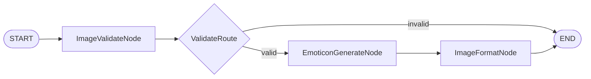

# Convert Cast

<!-- AUTO-MANAGED: cast-overview -->
## Overview

**Purpose:** 사용자가 업로드한 사진을 분석하고 스타일 트랜스퍼를 통해 카카오 이모티콘 이미지(PNG/WEBP)로 변환하여 반환

**Pattern:** Sequential (Branching) — 검증 분기 포함 선형 파이프라인

**Latency:** Medium (GPT-5.5 image API 호출)

**Input:** 사용자 업로드 이미지 (base64 인코딩 또는 bytes)

**Output:** 카카오 이모티콘 규격 이미지 (360×360px, PNG/WEBP, base64)
<!-- END AUTO-MANAGED -->

<!-- AUTO-MANAGED: architecture-diagram -->
## Architecture Diagram


<!-- END AUTO-MANAGED -->

<!-- AUTO-MANAGED: node-specifications -->
## Node Specifications

### Edges
- `START` → `ImageValidateNode`
- `ImageValidateNode` → `ValidateRoute` (condition)
- `ValidateRoute` →|valid| `EmoticonGenerateNode`
- `ValidateRoute` →|invalid| `END`
- `EmoticonGenerateNode` → `ImageFormatNode`
- `ImageFormatNode` → `END`

---

### ImageValidateNode (Custom — BaseNode)

**Responsibility:** 업로드된 이미지의 형식(PNG/JPEG/WEBP), 크기(최대 10MB), NSFW 안전성을 검증하고 `image_valid` 플래그와 함께 에러 메시지를 State에 기록

**State reads:** `image_data`, `image_format`

**State writes:** `image_valid` (bool), `validation_error` (str | None)

---

### ValidateRoute (Condition Function)

**Responsibility:** `image_valid` 값을 기반으로 라우팅 결정

**Routing:**
- `image_valid == True` → `EmoticonGenerateNode`
- `image_valid == False` → `END` (validation_error 포함 반환)

---

### EmoticonGenerateNode (Custom — BaseNode)

**Responsibility:** GPT-5.5 image 모델(OpenAI Images Edit API)을 호출하여 원본 이미지를 카카오 이모티콘 스타일(만화/카툰, 귀여운 표정 강조)로 변환. 이미지 분석과 생성을 단일 API 호출로 처리

**State reads:** `image_data`, `image_format`

**State writes:** `styled_image` (bytes)

---

### ImageFormatNode (Custom — BaseNode)

**Responsibility:** 생성된 이미지를 카카오 이모티콘 규격(360×360px, PNG/WEBP)으로 리사이즈·변환하고 base64 인코딩하여 최종 `result`에 저장

**State reads:** `styled_image`

**State writes:** `result` (str — base64 인코딩된 PNG/WEBP)
<!-- END AUTO-MANAGED -->

<!-- AUTO-MANAGED: cast-structure -->
## Cast Structure

```
casts/convert/
├── CLAUDE.md                  # This file
├── graph.py                   # ConvertGraph (StateGraph 조립)
├── pyproject.toml
└── modules/
    ├── state.py               # InputState, OutputState, State
    ├── nodes.py               # ImageValidateNode, EmoticonGenerateNode,
    │                          #   ImageFormatNode
    ├── conditions.py          # validate_route (condition function)
    ├── prompts.py             # 이모티콘 생성 시스템 프롬프트
    ├── tools.py               # (필요 시 외부 API 래퍼)
    └── utils.py               # 이미지 인코딩/디코딩 유틸리티
```
<!-- END AUTO-MANAGED -->

<!-- AUTO-MANAGED: development-commands -->
## Development Commands

```bash
# Convert Cast 의존성 추가
uv add pillow --directory casts/convert
uv add openai --directory casts/convert

# Convert Cast 테스트
uv run pytest tests/cast_tests/convert_test.py -v
```
<!-- END AUTO-MANAGED -->

<!-- MANUAL -->
## Notes

### 카카오 이모티콘 규격
- 크기: 360×360px
- 포맷: PNG (투명 배경 권장) 또는 WEBP
- 최대 파일 크기: 2MB

### 이모티콘 생성 모델
- **사용 모델:** gpt-image-1 (OpenAI Responses API)
- **API:** `openai.responses.create()` — 원본 이미지 + 카카오 이모티콘 스타일 프롬프트 전달
- **대안:** GPT-4o image, dall-e-3
<!-- END MANUAL -->
